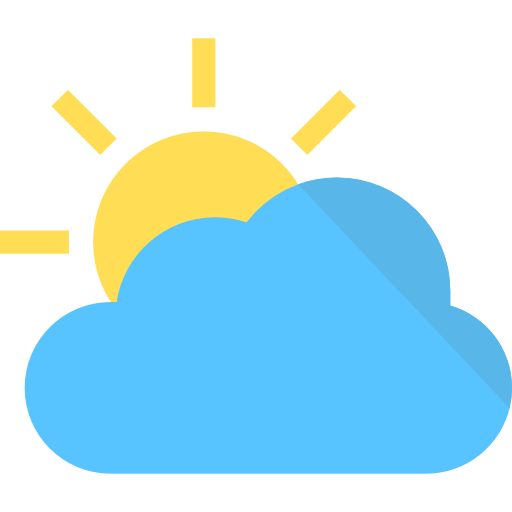

<div align="center">
    <a href="https://github.com/zhongtan912/weather-app">
        
    </a>
</div>

## Table of Contents

- [About the Project](#about-the-project)
  - [Built With](#built-with)
- [Getting Started](#getting-started)
  - [Prerequisites](#prerequisites)
  - [Installation](#installation)
- [Usage](#usage)
- [License](#license)
- [Contact](#contact)
- [Acknowledgements](#acknowledgements)

## About The Project


This is a Weather App to get the weather for a particular city by searching.

### Built With

- [Webpack](https://webpack.js.org/)
- [Babel](https://babeljs.io/)
- [React](https://reactjs.org/)
- [Redux](https://redux.js.org/introduction/getting-started)
- [OpenWeatherMap API](https://openweathermap.org/api)
- [Material UI](https://material-ui.com/)

## Getting Started

These instructions will get you a copy of the project up and running on your local machine for development and tesing purposes. See usage for notes on how to deploy the project in production.

## Prerequisites

- npm

## Installation

1. Clone the repo

```sh
git clone https://github.com/zhongtan912/weather-app.git
```

2. Install NPM packages

```sh
npm install
```

## Usage

### Local

To start a webpack development server listening on port 3000, run:

```bash
npm run start
```

To run tests in local, run:

```bash
npm run test
```

### Production

To perform all unit tests and start a http-server listening on port 8080, run:

```bash
npm run build
```

## Roadmap

See the [open issues](https://github.com/zhongtan912/weather-app/issues) for a list of proposed features (and known issues).

## Author

- Caleb Tan
